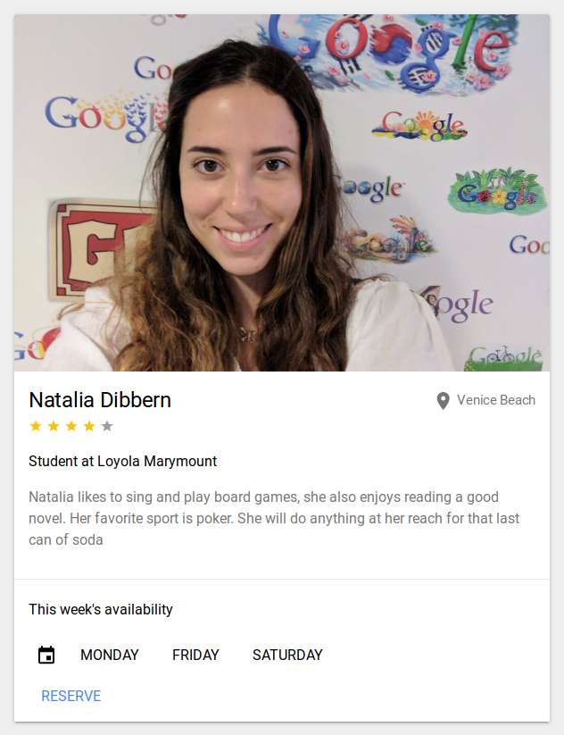
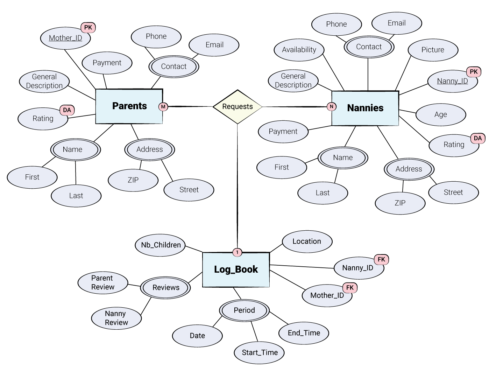

# Preliminary Database Design

## Description
Some months ago, Juan and I were watching an episode of the famous TV show "Friends", where Rachel and Ross where trying to find a nanny who could take care of their baby while they where at work. The scene represented them making interviews with different nannys and having a hard time finding the perfect one for their child. In that moment Juan and I had the idea of how that task could have been much easier for them if they had an app that could find the perfect nannny for them and save them that time.

This is how the idea of Bambinaia started. Our aim is to develop a website for matching mothers with nannies. The website will be created using Polymer 2.0, a JavaScript library that helps you create custom reusable HTML elements, and use them to build performant, maintainable apps.

Authentication, data storage and hosting will be done through Fire base, which lets you work on a real time database. The data appears as JSON files and allows real time changes to occur on the connected client side. When you build cross-platform apps using iOS, Android, JavaScript SDKs, clients end up getting all the data that was updated.

We know and value all the hard work that parents put into raising their children, but we understand as well that, as every human being, we all need some time off to focus… Bambinia provides parents to take some time off this work by at the same time having that ease of mind that their children are taken good care of. This app is perfect both for parents that are seeking for nannies as well as nannies that are seeking to get some hands on experience with children, or that would like to spend their free time earning extra cash. We know all families are different, and that all parents have different choices on the qualifications of their nanies, thats why Bambini helps them find the perfect nanny that can match their needs. Me gustaria explicar aca como esta app tambien sirbe para esos casos de emergencia donde no sabes con quien dejar a tu nene y podes ir a la app y conseguir a alguien right away.

## Data Description

Data store will be divided in three different entities: Parent information, Nanny Information and Log Entry

Parent information will

## Examples of Database
Data provided to the user (>=5)

## Schema

Table(s) descriptions and columns

## ERD
The following picture represnets our Entity-Relationship Diagram for Bambinaia's database:

