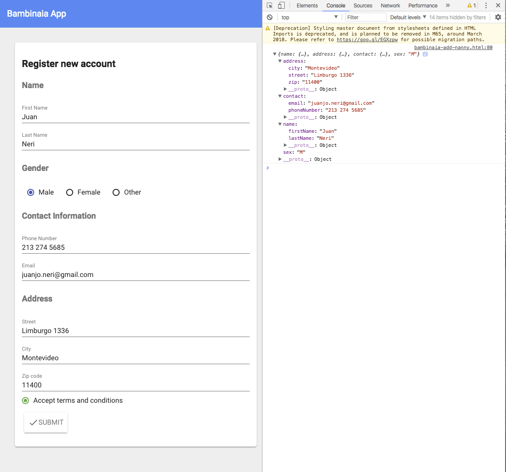

# Preliminary Database Design

## Description
Some months ago, Juan and Natalia were watching an episode of the famous TV show "Friends", where Rachel and Ross where trying to find a nanny who could take care of their baby while they where at work. The scene showed them scheduling interviews with different nannys and having a hard time finding the perfect one for their child. In that moment Juan and Natalia realized how that task could have been much easier for the characters have they had an app that could find the perfect nannny for them. This is how the idea of Bambinaia started. 

Our aim is to develop a website for matching parents with nannies. We know and value all the hard work that parents put into raising their children, but we understand as well that, as every human being, we all need some time off to focus on something else such as get work done, meeting an old friend or getting that deserved massage. Bambinia provides parents to take some time off  by at the same time having that ease of mind that their children are taken good care of. This app is perfect both for parents that are seeking for nannies as well as nannies that want to get some hands on experience with children, or that would like to spend their free time earning extra cash. We know all families are different, and that all parents have different choices on the qualifications of their nannies, that's why Bambinaia helps them find the perfect nanny that can match their needs. 

The website will be created using Polymer 2.0, a JavaScript library that helps you create custom reusable HTML elements, and use them to build performant, maintainable apps. Authentication, data storage and hosting will be done through Fire base, which lets you work on a real time database. The data appears as JSON files and allows real time changes to occur on the connected client side. 

## Data Description

Data store will be divided in three different entities: Parent information, Nanny Information and Log Entry

Parent information will

## Examples of Database
When a parent requests a Nanny, she/he should select a date and time of when she/he will need the service.  Bambinaia will then return a list of different Nannis that would be a good fit regarding the specified needs: time to request, location and specific needs about the Nanny.

Say the parent lives in Venice Beach. Then the following would be an example of a recommended nanny:

The card will show her availability, as well as information about the nanny, such as: name, rating, location, general description, occupation, availability, age. 

These are other examples that might have been retrieved from the database from this query:

| First Name | Last Name | General Description           | Availability | Occupation                             | Rating | Age  | Location       |
| ---------- | --------- | ----------------------------- | ------------ | -------------------------------------- | ------ | ---- | -------------- |
| Florencia  | Gomez     | Florencia speciality is in... | M W 4-10 pm  | Student at Loyola Marymount University | 4.5    | 19   | Venice Beach   |
| Victoria   | Neri      | Vic loves kids of all ages... | M W 12-6pm   | Student at Loyola Marymount University | 5.0    | 23   | Playa Vista    |
| Camila     | Garcia    | Cami has experience in...     | M W 2-11pm   | Student at UCLA                        | 4.2    | 21   | Marina Del Rey |
| Valeria    | Rodriguez | Vale enjoys children...       | M W 3-10pm   | Elementary teacher                     | 4.8    | 25   | Playa Vista    |
| Alejandra  | Rosales   | Ale has been a nanny for...   | M W 4-9 pm   | Nurse                                  | 4.9    | 30   | Santa Monica   |

Where each of these would be presented as a card similar to the one showed above.

If the parent wishes to select this nanny then she/he can send a request with a description of the need for the service (date and time, how many kids she needs to take care of etc). Now the Nanny will recieve a similar card with the parent's request, and she can decide whether she accepts or not. Once the request is accepted, the parent and nanny can both have access more information, such as contact information of each other respectively. 

## Schema

### Nanny

| First Name | Last Name | General Description           | Availability | Occupation                             | Rating | Age  | Location     | Nanny ID   | Phone       | Email                |
| ---------- | --------- | ----------------------------- | ------------ | -------------------------------------- | ------ | ---- | ------------ | ---------- | ----------- | -------------------- |
| Florencia  | Gomez     | Florencia speciality is in... | M W 4-10 pm  | Student at Loyola Marymount University | 4.5    | 19   | Venice Beach | 9595866898 | 13531315131 | flor.gomez@gmail.com |

### Parent

| First Name | Last Name | General Description | Phone       | Email               | Occupation                             | Rating | Age  | Location     | Parent ID   |
| ---------- | --------- | ------------------- | ----------- | ------------------- | -------------------------------------- | ------ | ---- | ------------ | ----------- |
| Maria      | Carrera   | I have two kids...  | 12453151641 | m.carrera@gmail.com | Student at Loyola Marymount University | 4.5    | 19   | Venice Beach | 96964565773 |

### Log Book

| Date       | Start    | End       | Number of Children | Mother review | Nanny review | Mother ID   | Nanny ID    | Location                                 |
| ---------- | -------- | --------- | ------------------ | ------------- | ------------ | ----------- | ----------- | ---------------------------------------- |
| 01/01/2016 | 8: 00 pm | 11: 00 pm | 2                  | 5.0           | 4.0          | 95959817513 | 85959817810 | 7270 W Manchester Ave, Los Angeles, CA, 90045 |

## ERD
The following picture represnets our Entity-Relationship Diagram for Bambinaia's database:

